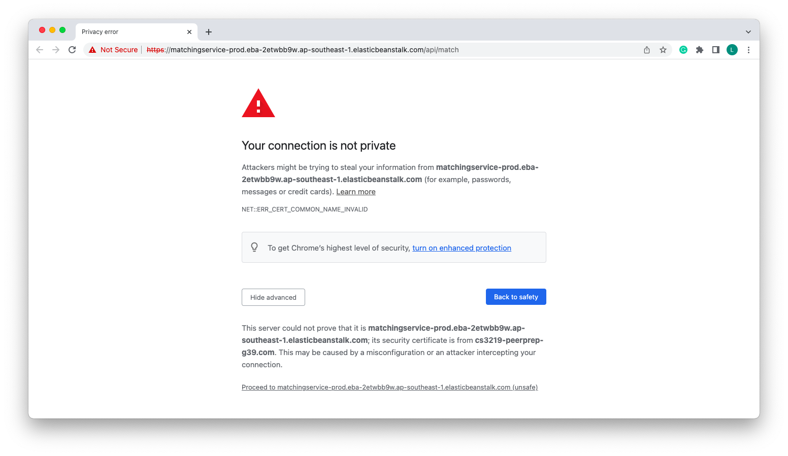

## Accessing the project via deployment
As the deployed microservices are not registered with a Public Certificate Authority, they are currently running using Self-Signed Certificates. For the application to work, please follow the steps below.
1. Access the respective microservices via the urls below:
- User Service: `To be updated with deployed User-Service URL`
- Question Service: `To be updated with deployed Question-Service URL`
- Matching Service: `To be updated with deployed Matching-Service URL`
- History Service: `To be updated with deployed History-Service URL`
- Twilio Service: `To be updated with deployed Twilio-Service URL`
2. Your browser should display a warning about the site, as shown in the image below.

3. Click on `Show advanced`, and select the option to proceed to the url. This would cause the browser to accept the self-signed certificate.
4. Repeat steps (2) and (3) for the remaining microservices.
5. Once done, access the deployed application at `https://www.cs3219-peerprep-g39.com`. The application should work as normal.

## Running the project locally
1. Clone the repository to your local device. Please ensure that the `.env` files are cloned.
2. Open up the project in your IDE, or traverse to the root directory of the project.
3. Run `cd frontend` from the root directory.
4. Run `npm i` in the `frontend` folder.
5. Run `npm run dev`. This command will boot all the services and frontend concurrently.

**Should the steps above not work, boot the services separately as illustrated in the section below**

## Running the services separately

### User Service
1. Open up a new terminal in the root directory.
2. Run `cd user-service` from the root directory.
3. Install npm packages using `npm i`.
4. Run User Service using `npm start`.
5. The service should be running on http://localhost:8000

### Matching Service
1. Open up a new terminal in the root directory.
2. Run `cd matching-service` from the root directory.
3. Install npm packages using `npm i`.
4. Run Matching Service using `npm start`.
5. The service should be running on http://localhost:8001

### Question Service
1. Open up a new terminal in the root directory.
2. Run `cd question-service` from the root directory.
3. Install npm packages using `npm i`.
4. Run Question Service using `npm start`.
5. The service should be running on http://localhost:8002

### History Service
1. Open up a new terminal in the root directory.
2. Run `cd history-service` from the root directory.
3. Install npm packages using `npm i`.
4. Run History Service using `npm start`.
5. The service should be running on http://localhost:8003

### Frontend
1. Open up a new terminal in the root directory.
2. Run `cd frontend` from the root directory.
3. Install npm packages using `npm i`.
4. Run frontend using `npm start`.
5. The application should be started on http://localhost:3000

### Twilio Code Sync Service
1. Open up a new terminal in the root directory.
2. Run `cd frontend/Twilio` from the root folder.
3. Run `npm start`.
4. The service should be started on http://localhost:3001